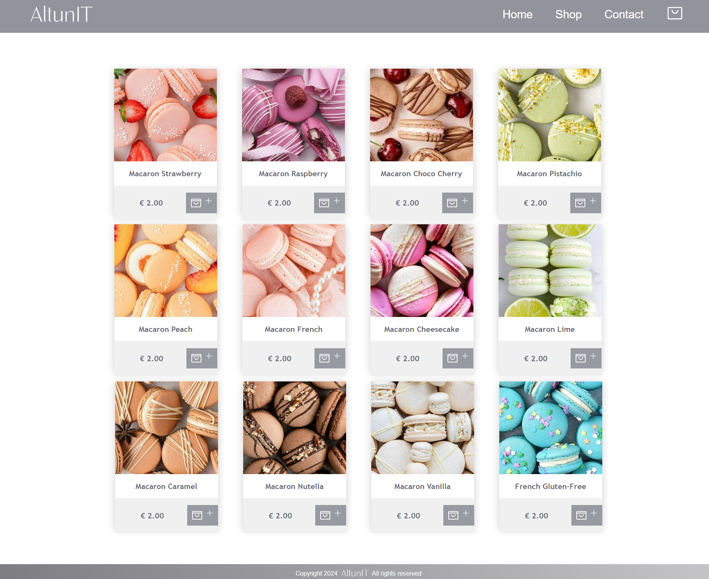

# AltunIT | Altun Macarons

# Opdrachtbeschrijving

## Inleiding
Welkom bij de AltunIT-cursus! Tijdens deze cursus leer je stap voor stap hoe je een prachtige, functionele website bouwt voor een macaronwinkel. We beginnen met het opzetten van de basisstructuur met HTML en CSS, waarbij we een Homepagina, Shop-pagina en Contactpagina vorm geven. Vervolgens leer je de basisprincipes van JavaScript, en als laatste transformeer je de website naar een moderne, schaalbare webapplicatie met ReactJS.

De cursus is opgedeeld in drie modules:
* Module 1: Bouw de basisstructuur van de website met HTML en CSS.
* Module 2: Leer de basis van JavaScript, inclusief datatypes, arrays, objecten, conditionele statements en meer.
* Module 3: Zet de website om naar ReactJS, voeg routing toe en maak de winkelwagen dynamisch en schaalbaar.

Aan het einde van de cursus beschik je over de vaardigheden om een professionele website te maken, inclusief dynamische functionaliteit en een moderne architectuur.

## Afbeelding 1: Eindresultaat van de Home Pagina | Altun Macarons website

# Stappenplan:
## In module 1: HTML & CSS
1. Hoofdstuk 4: Navigatiebalk, Banner en Footer voor de Homepagina
   - Bouw een navigatiebalk met links naar de Home-, Shop-, Contact-, en Winkelwagenpagina’s. In Module 3 leer je hoe je deze links werkend maakt met React Router.
   - Daarna voegen we de banner toe aan de Homepagina, waarin de titel van de website en een call-to-action knop te vinden zijn. 
   - Je leert ook hoe je afbeeldingen als achtergrond kunt gebruiken en hoe je met CSS Flexbox een nette lay-out maakt.
   - Tot slot maken we de footer, die informatie bevat over het copyright en eventueel links naar een website. Dit geeft de website een professioneel en afgerond uiterlijk.
2. Hoofdstuk 4: Indeling van de Shop-pagina
   - We ontwerpen de Shop-pagina, waar een overzicht van verschillende macaron-producten in een nette grid-layout komt te staan. Hiervoor maken we gebruik van CSS Grid.
   - Elk product bevat een afbeelding, een naam en een prijs. Je leert hoe je met CSS een nette en overzichtelijke indeling maakt.
   - De Shop-pagina zal nog niet dynamisch reageren omdat we in Module 3 (ReactJS) de functionaliteit zullen toevoegen.
4. Hoofdstuk 6: Contactformulier maken
   - In dit hoofdstuk maak je een contactformulier voor de Contactpagina. Het formulier bevat velden voor voornaam, achternaam, e-mailadres, en een bericht.
   - We leren hoe je HTML-formulieren kunt gebruiken en hoe je ze met CSS kunt stylen om een professioneel uiterlijk te creëren.
   
## In module 2: JavaScript
1. Basiskennis JavaScript
   - Leer de fundamenten van JavaScript, zoals het werken met datatypes, arrays, objecten, loops en conditionele statements.
   - Begrijp hoe operatoren werken en hoe je logica toevoegt aan je webpagina’s.
   

## In module 3: ReactJS
5. Omzetten van de website naar ReactJS
   - In deze module zetten we de bestaande HTML en CSS om naar ReactJS. ReactJS is een krachtig JavaScript-framework waarmee je websites schaalbaarder en onderhoudsvriendelijker maakt. Dit doen we door gebruik te maken van herbruikbare componenten. In plaats van dezelfde code steeds opnieuw te schrijven, kunnen we componenten maken die overal op de website hergebruikt kunnen worden.
6. Routing tussen pagina's instellen
   - We gebruiken React Router om de navigatie tussen de vier pagina's te implementeren: de Homepagina, Shop, Contact, en de Winkelwagen.
   - React Router maakt het mogelijk om de navigatie tussen deze pagina's snel en efficiënt te laten verlopen zonder dat de hele pagina opnieuw geladen hoeft te worden.
7. Winkelwagen functionaliteit afronden
   - We maken de winkelwagen volledig functioneel met behulp van React Hooks. Dit zorgt ervoor dat producten in de winkelwagen dynamisch worden bijgewerkt.

## Eindopdracht: Website Finaliseren
   - In de eindopdracht combineren we alles wat je hebt geleerd om een volledige, gestileerde website te maken. Je zorgt voor consistentie in de opmaak en maakt de website responsief met CSS media queries, zodat hij er goed uitziet op zowel desktops als mobiele apparaten.

# Einddoel
Aan het einde van de cursus beschik je over de vaardigheden om een complete, professioneel gestileerde website te maken met HTML en CSS. Je leert hoe je de structuur van een website opbouwt, verschillende pagina's zoals de Homepagina, Shop, Contactpagina, en Winkelwagen indeelt, en hoe je een navigatiebalk en footer toevoegt om je website af te ronden.
Je beschikt nu over de basisvaardigheden om aantrekkelijke en functionele websites te bouwen. Je bent klaar om je kennis verder uit te breiden met meer geavanceerde webtechnieken in toekomstige cursussen, zoals JavaScript en ReactJS.

Deze cursus legt een stevige basis voor jouw reis als front-end webontwikkelaar. Je bent klaar om verder te leren en je vaardigheden uit te breiden met back-end technologieën, geavanceerde technieken en frameworks.

## Afbeelding 2: Eindresultaat van de Altun Macarons website

Dit is het eindresultaat van de cursus, waarin je een volledig functionele en professioneel gestileerde website voor een macaronwinkel maakt.
